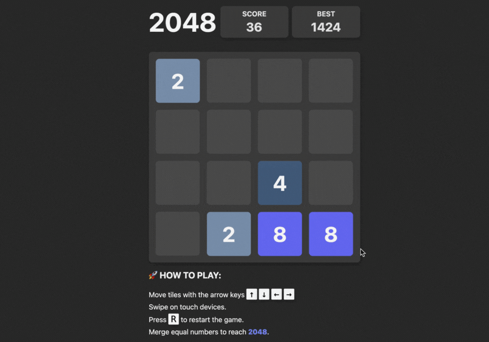

# 2048 Clone (Vanilla TypeScript)

A clone of the 2048 puzzle game built with **Vanilla TypeScript**. This project focuses on DOM manipulation, custom event handling, and accessible UI patterns without the use of external frameworks.

### [Live Demo](https://my-2048.pages.dev/)

<div align="center">
  <a href="https://my-2048.pages.dev/">
    
  </a>
</div>

## 🛠️ Technical Stack
- `TypeScript` (Vanilla) — Game logic
- `SCSS` — Styling
- `Vite` — Build tool
- `Biome`, `Stylelint` — Linting

## 💡 Key Features
- **Custom Game Logic**: Full implementation of tile merging, spawning, and move validation.
- **Persistence**: `localStorage` integration for high-score tracking.
- **Cross-Platform**: Touch-event swipe detection for mobile and keyboard listeners for desktop.
- **Performance Optimized**: CSS transforms for GPU-accelerated animations, avoiding layout thrashing.

## ♿ Accessibility (A11y)
- **Screen Readers**: Integrated ARIA live regions to announce tile merges and game states (win/loss).
- **Focus Management**: Automatic focus trapping on both game-over and win modals for keyboard navigation.
- **Reduced Motion**: Support for `prefers-reduced-motion` media queries.


## 📝 Technical Challenges & Solutions

1. **Efficient DOM Updates**  
I implemented logic that updates only the necessary tiles, using CSS `transform` for movement instead of `top/left`. I ensured animations remain at 60fps by staying within the "Composite" layer of the rendering pipeline, avoiding the "Layout" phase.

2. **Touch Logic Implementation**  
I created a custom touch-start/touch-end handler to manage mobile swipes without a library. This involved calculating vector deltas and setting a minimum threshold to distinguish swipes from accidental taps.

3. **State Management in Vanilla TS**  
I used a 2D array to represent the game board and TypeScript interfaces to ensure type safety across movement and merge logic, reducing runtime bugs during complex merge calculations.

## 🚦 Development Setup

```bash
# Clone the repository
git clone https://github.com/home2ego/my-2048.git

# Go to repository
cd my-2048

# Install dependencies
npm install

# Run development server
npm run dev